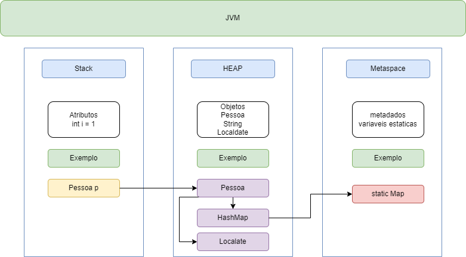

<div align="center">

  
  <h1>JVM</h1>
  
<!-- Badges -->
<p>
  <a href="https://github.com/wesleyosantos91/JVM/graphs/contributors">
    
  </a>
  <a href="">
    
  </a>
  <a href="https://github.com/wesleyosantos91/JVM/network/members">
    
  </a>
  <a href="https://github.com/wesleyosantos91/JVM/stargazers">
    
  </a>
  <a href="https://github.com/wesleyosantos91/JVM/issues/">
    
  </a>
  <a href="https://github.com/wesleyosantos91/JVM/pulls/">
    
  </a>
  <a href="https://github.com/wesleyosantos91/JVM/blob/main/LICENSE">
    
  </a>
</p>
   
<br />
</div>

<!-- About the Project -->
## :star2: Sobre o projeto:
<p>
    Este repositório destina-se a fornecer recursos e exemplos para estudar e entender a Máquina Virtual Java (JVM).</br>
    A JVM é um componente essencial da plataforma Java e é responsável por executar programas Java compilados em bytecode.
</p>

<!-- Screenshots -->
### :camera: Memória JVM:

<div align="center"> 
  
</div>

#### Stack:
> A memória da pilha (stack) é usada para armazenar dados locais e referências a objetos para cada método em execução na JVM. Cada thread possui sua própria pilha de execução, onde são mantidos os registros de ativação e as variáveis locais. As variáveis locais e referências a objetos são removidas automaticamente quando o método é concluído, o que torna a memória da pilha eficiente para gerenciamento de memória temporária e rápida alocação e desalocação de recursos.
> - Área de memória usada para armazenar variáveis locais e informações de chamada de método.
> - Cada thread possui sua própria stack, que cresce e diminui à medida que métodos são chamados e retornados.
> - Armazena tipos de dados primitivos (int, float, etc.) e referências a objetos.
> - Tamanho geralmente menor que o heap.

> Exemplo de configuração da memória Stack:
<br> obs: essa configuração normalmente não é utilizada.

```bash
  java -Xss1m Main.java
```

Neste exemplo, -Xss1m define o tamanho da pilha como 1 megabyte. Você pode substituir 1m pelo tamanho desejado em megabytes.

#### Heap:
> O heap é a área de memória compartilhada entre todas as threads em uma aplicação Java, utilizada para armazenar objetos e arrays dinamicamente alocados. Ele é gerenciado pelo coletor de lixo (GC) da JVM, que é responsável por liberar a memória de objetos não utilizados para evitar vazamentos de memória. O heap é dividido em duas partes principais: a geração nova (young generation) e a geração antiga (old generation), que são utilizadas para otimizar o processo de coleta de lixo.
> - Área de memória usada para alocar objetos dinamicamente.
> - Compartilhado por todas as threads da aplicação.
> - Gerenciado pelo coletor de lixo.
> - Tamanho pode ser configurado e ajustado.

> Exemplo de configuração da memória Heap:

```bash
  java -Xms128m -Xmx512m Main.java
```

-Xms e -Xmx são parâmetros de linha de comando usados para especificar o tamanho inicial e máximo da memória alocada para a JVM (Java Virtual Machine).

-Xms: Este parâmetro especifica o tamanho inicial da memória que será alocada para o heap da JVM no momento em que a JVM é iniciada. Por exemplo, se você definir -Xms512m, isso significa que a JVM será iniciada com 512 megabytes de memória alocada para o heap.

-Xmx: Este parâmetro especifica o tamanho máximo da memória que a JVM pode alocar para o heap durante a execução do programa. Se você definir -Xmx1024m, isso significa que a JVM pode alocar até 1024 megabytes de memória para o heap durante a execução do programa.

#### Metaspace:
> A Metaspace é uma área de memória na JVM que substitui permanentemente a área de PermGen (geração permanente) nas versões mais recentes do Java. Ela é responsável por armazenar metadados relacionados a classes, como informações sobre classes carregadas, métodos, constantes e estruturas de dados internas da JVM. Ao contrário da PermGen, a Metaspace é dimensionada dinamicamente pela JVM e pode crescer ou diminuir conforme a necessidade, o que reduz a probabilidade de erros de alocação de memória relacionados à área de metadados.
> - Introduzido na versão 8 do Java.
> - Substituiu o PermGen.
> - Armazena metadados da JVM, como classes, métodos e strings.
> - Tamanho não é fixo e pode crescer dinamicamente.
> - Monitoramento de uso é importante para evitar OutOfMemoryError.

> Exemplo de configuração da memória Metaspace:
<br> obs: essa configuração normalmente não é utilizada.

```bash
  java -XX:MaxMetaspaceSize=256m Main.java
```

### GC - Garbage Collection (Coletor de lixo)

> O Garbage Collection (GC) é um processo automático da JVM (Java Virtual Machine) responsável por identificar e liberar memória de objetos que não estão mais sendo utilizados pela aplicação. Isso evita vazamentos de memória, que podem levar a problemas de desempenho e estabilidade.

#### O que GC pode evitar:

##### Memory Leak:
> Imagine que você tem uma torneira que fica pingando água constantemente, mas você nunca fecha. Com o tempo, a água vai se acumulando e eventualmente transborda, causando desperdício. Da mesma forma, um "memory leak" ocorre quando um programa continua alocando memória sem liberá-la, o que pode levar a problemas de desempenho ou até mesmo ao travamento do programa.

##### Dangling Pointer:
> Agora, imagine que você anote o endereço de um lugar em um papel, mas esse lugar é demolido antes que você tenha a chance de usá-lo. Se você olhar para o papel, você ainda terá o endereço, mas ele não leva a lugar nenhum. Isso é como um "dangling pointer", que ocorre quando um programa usa um endereço de memória que já foi liberado, resultando em comportamento imprevisível ou até mesmo falhas.

#### Tipos de algoritimos GC:

##### Java 8
- Parallel GC (default)
  - Projetado para alto rendimento (throughput) em sistemas multiprocessados
  - Divide o heap em regiões e coleta cada região em paralelo usando várias threads.
  - Adequado para aplicações que necessitam de alto throughput e não sofrem muito com pausas curtas na garbage collection.
- Serial GC
  - Coletor de lixo mais simples, utiliza apenas uma thread.
  - Adequado para aplicações single-threaded ou com recursos limitados, pois tem baixo overhead.
- CMS GC
  - Coletor de lixo "concurrent", permitindo que a aplicação continue executando durante a coleta de lixo.
  - Minimiza o tempo de parada da aplicação, mas pode ter um impacto maior no rendimento geral.
  - Adequado para aplicações sensíveis à latência que necessitam de pausas curtas e previsíveis na garbage collection.

> Exemplo usando o Parallel GC:

```bash
  java -XX:+UseSerialGC Main
```

> Exemplo usando o Serial GC:

```bash
  java -XX:+UseSerialGC Main
```

> Exemplo usando o CMS GC:

```bash
  java -XX:+UseConcMarkSweepGC Main
```

##### Java 11
- G1 GC (default)
  - Coletor de lixo de última geração, oferecendo melhor performance e escalabilidade.
  - Divide o heap em regiões de diferentes tamanhos e coleta cada região de forma independente.
  - Adapta-se dinamicamente às necessidades da aplicação, priorizando regiões com maior probabilidade de conter objetos inutilizados.
  - Adequado para uma ampla gama de aplicações, desde aplicações single-threaded até aplicações multiprocessadas com cargas de memória variáveis.
- Serial GC
  - (Mesma descrição do Java 8)
- Shenandoah GC (experimental)
  - Coletor de lixo experimental projetado para aplicações com grandes conjuntos de dados.
  - Utiliza um algoritmo de "copying", copiando objetos sobreviventes para uma nova região do heap e liberando a memória da região antiga.
  - Pode ser benéfico para aplicações que alocam e desalocam grandes quantidades de dados, mas pode ter um overhead maior em comparação ao G1 GC.
- ZGC (experimental)
  - Coletor de lixo experimental focado em baixa latência.
  - Utiliza um algoritmo de "region-based memory management", gerenciando o heap em regiões e coletando cada região individualmente.
  - Projetado para minimizar o tempo gasto em pausas durante a coleta de lixo, geralmente abaixo de 1 milissegundo.
  - Adequado para aplicações críticas à latência, como sistemas em tempo real ou processamento de alta frequência, mas requer testes rigorosos devido ao seu estado experimental.

> Exemplo usando o G1 GC:

```bash
  java -XX:+UseG1GC Main
```

> Exemplo usando o Shenandoah GC (experimental):

```bash
  java -XX:+UseShenandoahGC Main
```

> Exemplo usando o ZGC (experimental):

```bash
  java -XX:+UseZGC Main
```

##### Java 17
- G1 GC (default)
  - (Mesma descrição do Java 11)
- Serial GC
  - (Mesma descrição do Java 8)
- Shenandoah GC (experimental)
  - (Mesma descrição do Java 11)
- ZGC (experimental)
  - (Mesma descrição do Java 11)

##### Java 21
- G1 GC (default)
  - (Mesma descrição do Java 11)
- Serial GC
  - (Mesma descrição do Java 8)
- Shenandoah GC (experimental)
  - (Mesma descrição do Java 11)
- ZGC (experimental)
  - (Mesma descrição do Java 11)


### JVM: Compilação Just-In-Time (JIT) e Ahead-Of-Time (AOT)

#### Just In Time (JIT) Compilation:  
> A JVM inicialmente executa o código Java como um interpretador, o que pode ser mais lento do que linguagens compiladas nativamente como C. Para melhorar o desempenho, a JVM usa a compilação Just-in-Time (JIT), que traduz partes do código Java para código de máquina nativo durante a execução. A JVM identifica as partes do código mais usadas ("hotspots") e as compila, acelerando a execução. O processo de compilação JIT ocorre em segundo plano e não interrompe a execução do aplicativo. A compilação JIT permite que o código Java seja executado de forma mais eficiente, aproximando-se do desempenho de linguagens compiladas nativamente, sem perder a portabilidade do Java. É importante considerar o impacto da compilação JIT ao avaliar o desempenho do código, pois o desempenho pode variar antes e depois da compilação. A JVM pode compilar qualquer sequência de bytecode, que, do ponto de vista do programador, pode ser entendida como qualquer método ou bloco de código.

> O parâmetro -XX:+PrintCompilation é uma ferramenta poderosa para entender e otimizar o desempenho da compilação JIT em aplicações Java. Ele fornece informações detalhadas sobre quais métodos estão sendo compilados e como, permitindo que você tome decisões informadas sobre otimizações de código e configurações da JVM.

```bash
  java -XX:+PrintCompilation Main
```

##### Exemplo:

| Timestamp (ms) | Ordem | Flags | Nível de Otimização | Método | Tamanho (bytes) |
|---|---|---|---|---|---|
| 6896 | 86 | n | 0 | java.lang.StringLatin1::hashCode | 44 |
| 6903 | 87 | s | 3 | java.lang.String::hashCode | 14 |
| 6906 | 88 | % | 4 | sun.nio.cs.UTF_8::updatePositions | 410 |

- N: Método nativo (implementado em linguagem de baixo nível)
- S: Método sincronizado (usa bloqueio para garantir acesso exclusivo)
- %: Método otimizado e armazenado no cache de código para execução mais rápida

> Na saída da compilação JIT, o "Nível de Otimização" é um número de 0 a 4 que indica a intensidade das otimizações aplicadas pela JVM ao compilar um método para código de máquina nativo. Quanto maior o nível, mais agressivas e complexas são as otimizações, buscando maximizar o desempenho do código.

> Significado dos níveis:

- 0: Nenhuma otimização. O método é interpretado diretamente a partir do bytecode, sem compilação - JIT.
- 1: Otimizações básicas e rápidas. A JVM aplica otimizações simples e de baixo custo, como eliminação de código morto e propagação de constantes.
- 2: Otimizações intermediárias. A JVM aplica otimizações mais complexas, como inlining de métodos pequenos e eliminação de alocações desnecessárias.
- 3: Otimizações avançadas. A JVM realiza análises mais profundas do código e aplica otimizações mais agressivas, como loop unrolling e otimizações baseadas em profiling.
- 4: Otimizações mais avançadas. A JVM utiliza informações de profiling coletadas durante a execução para aplicar otimizações altamente específicas e direcionadas ao comportamento do código em tempo real.

> Compiladores C1 e C2:
> A JVM geralmente possui dois compiladores JIT:

- C1 (Client Compiler) é responsável por otimizações mais simples e rápidas, correspondendo principalmente aos níveis 1 e 2, otimizando o código de maneira mais leve, visando um tempo de inicialização rápido e eficiência em métodos que não são tão críticos para o desempenho a longo prazo.
- C2 (Server Compiler) realiza otimizações mais agressivas e profundas, relacionadas aos níveis 3 e 4, aplicando técnicas de otimização avançadas para maximizar o desempenho de métodos "quentes" (executados frequentemente) e mais críticos..

#### Ahead-Of-Time (AOT):
> A compilação Ahead-of-Time (AOT) é uma abordagem alternativa à JIT, onde o código Java é traduzido para código de máquina nativo antes da execução do programa, geralmente durante o processo de build. Isso elimina a necessidade de compilação em tempo de execução, resultando em tempos de inicialização mais rápidos e um desempenho mais consistente, especialmente em dispositivos com recursos limitados ou em cenários onde a latência é crítica. No entanto, a AOT pode aumentar o tamanho do executável e limitar algumas otimizações dinâmicas que a JIT pode realizar. A escolha entre AOT e JIT depende das necessidades específicas da aplicação e do ambiente de execução.

### Ferramentas de troubleshooting em Aplicações sobre a JVM

#### Heap Dump e Thread Dump: Revelando o que acontece dentro da sua aplicação:

##### 1. Heap Dump: 
> Um heap dump é uma "fotografia" detalhada da memória de um programa em um determinado momento. Ele contém informações sobre todos os objetos presentes na memória, suas referências e seus tamanhos. O heap dump é útil para identificar vazamentos de memória, ou seja, situações em que a aplicação está alocando mais memória do que deveria e não liberando-a adequadamente, o que pode causar lentidão ou falhas no sistema.

##### 2. Thread Dump:
> Já um thread dump é um instantâneo do estado de todas as threads em execução em um programa Java. Ele mostra quais threads estão ativas, quais estão bloqueadas aguardando por recursos e onde estão no código fonte. O thread dump é uma ferramenta valiosa para diagnosticar problemas de concorrência, como deadlocks (situações em que duas ou mais threads estão bloqueadas indefinidamente aguardando por recursos que a outra tem) e condições de corrida (quando duas ou mais threads tentam acessar recursos compartilhados simultaneamente, resultando em comportamento imprevisível).


##### Tabela com detalhes:

| Tipo de Dump        | O que captura             | Uso                                                                                              |
|---------------------|---------------------------|--------------------------------------------------------------------------------------------------|
| Heap Dump           | Memória heap              | Diagnosticar vazamentos de memória, analisar estado de objetos, identificar objetos grandes.     |
| Thread Dump         | Estado de todas as threads| Diagnosticar problemas de threads, analisar fluxo de execução, identificar threads bloqueadas.   |

<br>

#### Ferramentas:

- [VisualVM](https://visualvm.github.io/index.html) : 
O VisualVM é uma ferramenta de monitoramento e análise de desempenho para aplicativos Java. Ele fornece uma interface gráfica intuitiva para acompanhar o consumo de memória, a utilização da CPU, o comportamento da thread e outras métricas importantes durante a execução de uma aplicação Java. Além disso, o VisualVM oferece recursos de perfil de desempenho, permitindo identificar gargalos e otimizar o código para melhorar a eficiência e o desempenho do aplicativo. Em suma, o VisualVM é uma ferramenta valiosa para desenvolvedores Java entenderem e otimizarem o desempenho de seus aplicativos durante o desenvolvimento e a manutenção.</br>
O VisualVM também é capaz de auxiliar na análise de heap dumps e thread dumps, permitindo aos desenvolvedores identificar vazamentos de memória, problemas de concorrência e outras questões relacionadas à gestão de memória e ao comportamento das threads em aplicativos Java. Esses recursos adicionais são fundamentais para a resolução de problemas complexos de desempenho e estabilidade em aplicações Java.

- [Jstack -  Java Thread Dump Analyzer (JTDA)](https://jstack.review) : 
O Java Thread Dump Analyzer, ou jstack, é uma ferramenta do JDK usada para diagnosticar problemas de desempenho em aplicações Java. Ela gera e analisa despejos de threads, oferecendo insights sobre o estado das threads, monitores bloqueados e outros aspectos relacionados à concorrência. Além disso, o jstack lê o thread dump, fornecendo aos desenvolvedores informações cruciais para identificar e resolver problemas como deadlocks e gargalos de desempenho. É uma ferramenta essencial para garantir a estabilidade e eficiência das aplicações Java.

- [Java Mission Control (JMC)](https://jdk.java.net/jmc/9/): O Java Mission Control é uma ferramenta de monitoramento e análise de desempenho desenvolvida pela Oracle, projetada para ajudar os desenvolvedores a gerenciar e otimizar suas aplicações Java. Ele oferece uma interface gráfica para visualizar dados de execução em tempo real, além de permitir a coleta e análise de dados de profiling através de eventos e métricas do sistema. O JMC é particularmente útil para identificar problemas de desempenho, como consumo excessivo de memória ou uso de CPU, e fornece funcionalidades avançadas, como a análise de heap dumps e a visualização de dados históricos. Essa ferramenta é integrada ao Java Flight Recorder, permitindo uma análise detalhada do comportamento da aplicação, tornando-a valiosa para diagnosticar e resolver problemas de desempenho em ambientes de produção.

##### Tabela com detalhes:

| Ferramenta                            | Funcionalidades                                                                                                       |
|---------------------------------------|-----------------------------------------------------------------------------------------------------------------------|
| Java Thread Dump Analyzer (JTDA)      | - Visualização de threads - Identificação de deadlocks - Análise de stack traces - Filtragem e agrupamento de threads |
| Jstack                                | - Obtenção de thread dumps - Identificação de threads bloqueadas - Análise de stack traces                            |

##### Alternativas de ferramentas:
- Ferramenta de monitoramento e análise de desempenho para aplicativos Java
  - [GCEasy](https://gceasy.io/)
  - [Jprofile](https://www.ej-technologies.com/products/jprofiler/overview.html)
- Java Thread Dump Analyzer (JTDA)
  - [FastThread](https://fastthread.io/)
  - [SpotifyThreadDump](https://spotify.github.io/threaddump-analyzer/)
